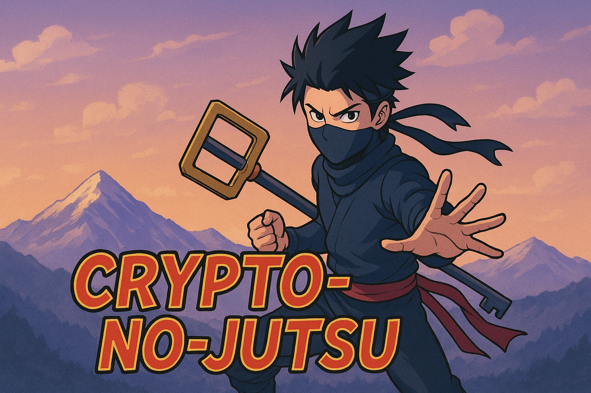

<!-- GITHUB BANNER -->
<p align="center">
  
</p>

# 🔑 Crypto no Jutsu

*A command-line ninjutsu for mastering cryptographic keys.*

This tool lets you **derive**, **verify**, and **manage cryptographic keys** using PBKDF2-HMAC with SHA-256.
Think of it as your **chakra control training**—but for passwords and keys. ⚡

---

## 🚀 Features

* 🔒 **Derive secure keys** from password + salt
* ✅ **Verify** a password against a stored Base85 key
* 📝 **Save / load keys** from files
* ⚙️ **Custom parameters**: key length & iteration count

---

## 🛡️ Recommended PBKDF2-HMAC Parameters

Choose parameters based on your threat model and needs:

| Scenario                  | Iterations      | Key Length (bytes) | Salt Length (bytes) | Notes                                           |
|---------------------------|-----------------|--------------------|---------------------|-------------------------------------------------|
| Normal                    | 600,000–1,200,000   | 64–128           | 16–32              | Good protection for everyday use                |
| Journalist/Whistleblower  | 2,000,000–5,000,000 | 128              | 32                  | Higher cost for attackers, strong salt required |
| Life-and-Death            | 10,000,000+        | 128–256           | 32+                 | Maximum security, may impact performance        |

- **More iterations** = Slower brute-force attacks, but slower for you too.
- **Longer salts** prevent rainbow table and precomputation attacks.
- **Key length**: 128 bytes is strong for most uses; 256 bytes for extreme cases.
- Always use a *unique* salt per password/key!

---

## 🛠️ Usage

### Derive a new key

```bash
python crypto_no_jutsu.py --derive
```

You’ll be prompted for:

* **Salt** (hidden input)
* **Password** (hidden input)
* Confirmation to **save or just print** the key

---

### Verify an existing key

```bash
python crypto_no_jutsu.py --verify --key "<Base85Key>"
```

or verify from a file:

```bash
python crypto_no_jutsu.py --verify --path derived_key.txt
```

---

### Options

* `--length` → Key length in bytes (default: `128`)
* `--iterations` → PBKDF2 iterations (default: `2,000,000`)
* `--key` → Base85 key string (for `--verify`)
* `--path` → File path to load stored key

---

## 📦 Requirements

* Python **3.7+**
* Install dependencies:

  ```bash
  pip install cryptography
  ```

---

## 🛡️ Security Tips

* 🧂 Always use a **strong, unique salt** per password
* 🔑 Keep derived keys **private and secure**
* 🚫 Never hardcode or share your password/salt
* 🔄 Consider rotating keys regularly

---

## 🌸 Example Workflow

1. Derive a new key:

   ```bash
   python crypto_no_jutsu.py --derive
   ```
2. Save it into `mykeys.txt`
3. Later, verify a password:

   ```bash
   python crypto_no_jutsu.py --verify --path mykeys.txt
   ```

---

✨ Now you can wield **crypto-no-jutsu** to protect your secrets like a true shinobi.